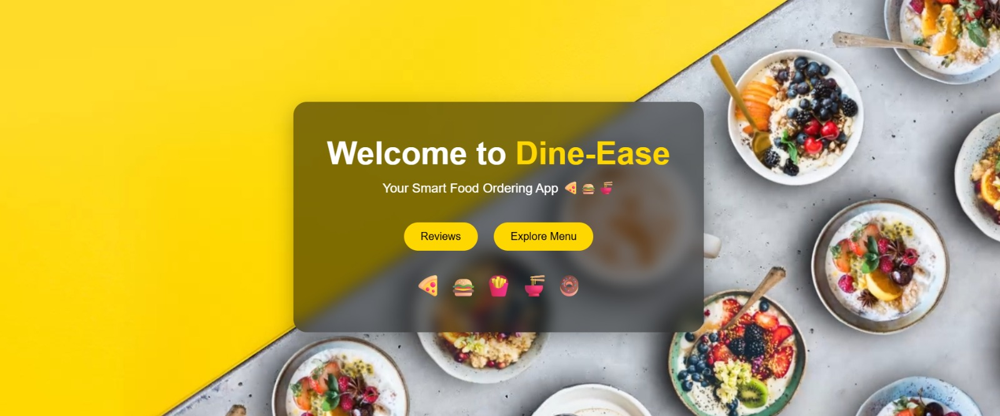
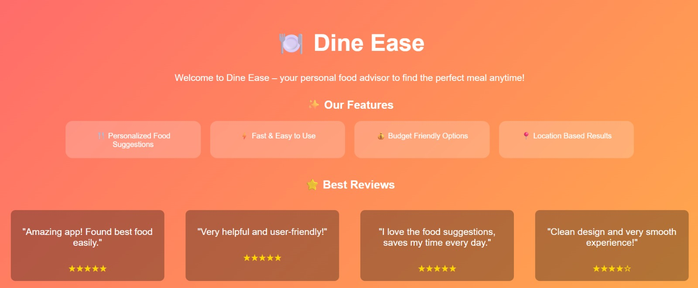
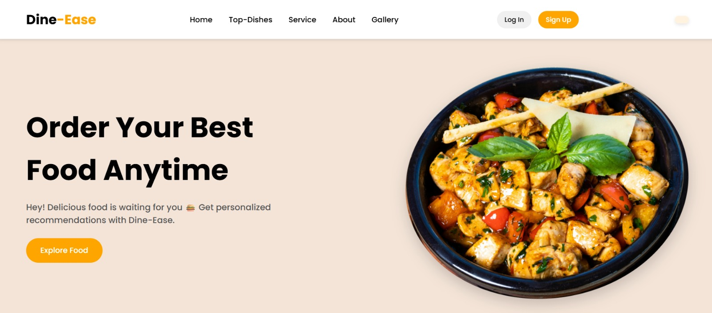
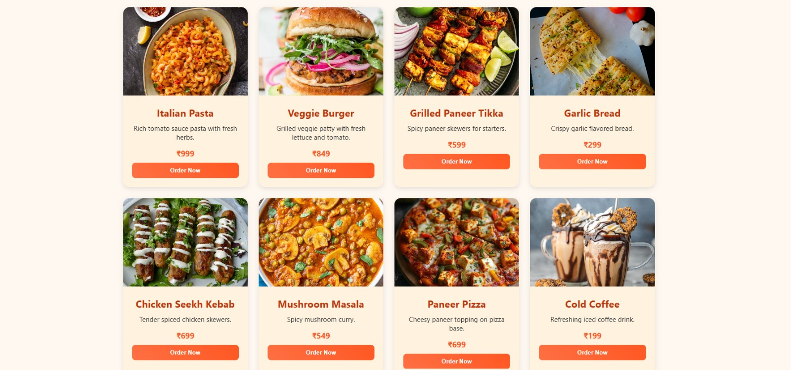
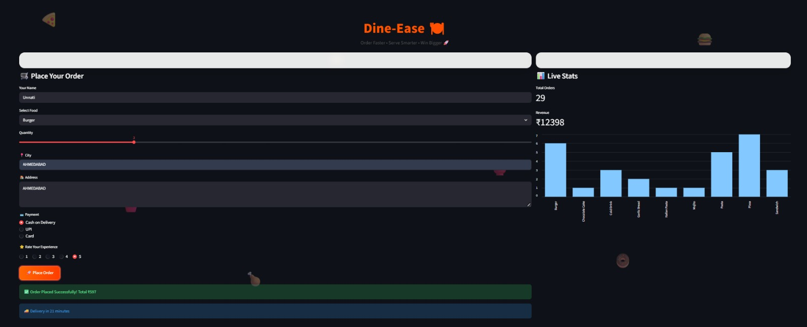

# 🍽️ Dine Ease

Dine Ease is a modern restaurant management and food ordering web application designed to provide a seamless dining experience for customers while simplifying restaurant operations.

## 🚀 Project Overview

The application allows users to browse food menus, explore restaurant offerings, create accounts, and interact with an intuitive restaurant interface. The project focuses on user-friendly design, responsive layouts, and smooth navigation.

## ✨ Features

- Secure User Registration and Login
- Interactive Food Menu Display
- Restaurant Information Dashboard
- Responsive User Interface
- Dynamic Navigation Experience
- Modern and Clean Design
- Streamlit-Powered Backend Integration

## 🛠️ Technologies Used

- HTML5
- CSS3
- JavaScript
- Python
- Streamlit

## 📸 Screenshots

### Welcome Page

### Review Section

### explore Page

### Menu Page

### Signup Page

### login Page

### Order Page

## 🎯 Learning Outcomes

Through this project, I gained hands-on experience in:

- Frontend Web Development
- User Interface Design
- Python Application Development
- Streamlit Framework
- Project Organization and Deployment

## 👩‍💻 Developer

**Unnati**

Final Year Student | AI & Software Enthusiast

GitHub: https://github.com/unnaticreates

## 🔮 Future Improvements

- Online Payment Integration
- Order Tracking System
- Admin Dashboard
- Database Connectivity
- Customer Analytics
- AI-based Food Recommendations
